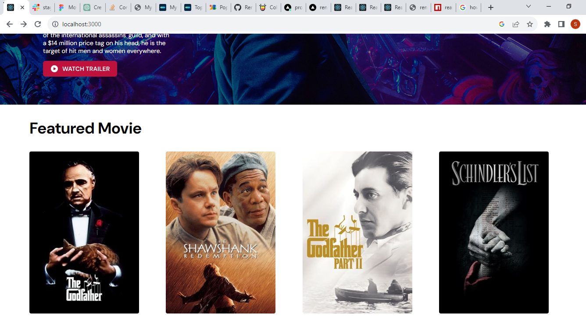

# MovieBox - Movie Discovery Web Application

MovieBox is a feature-rich movie discovery web application that allows users to search for movies, view movie details, and save their favorite movies. It consumes data from the TMDB API.



## Table of Contents

- [Introduction](#introduction)
- [Features](#features)
- [Getting Started](#getting-started)
  - [Prerequisites](#prerequisites)
  - [Installation](#installation)
  - [Obtaining TMDB API Key](#obtaining-tmdb-api-key)
- [Project Structure](#project-structure)
- [Usage](#usage)
  - [Starting the Development Server](#starting-the-development-server)
  - [Using the Application](#using-the-application)
- [API Integration](#api-integration)
- [Error Handling](#error-handling)
- [Contributing](#contributing)

## Introduction

MovieBox is a movie discovery web application built with React, providing users with a seamless experience to explore and learn about their favorite movies. It uses the TMDB API to fetch movie data, enabling users to search for movies by title, view movie details, and save movies to their favorites.

## Features

- **Homepage:** Displays the top 10 movies in a grid layout with movie posters, titles, and release dates.
- **Movie Details:** Detailed movie information is available when clicking on a movie card, including the title, release date (in UTC), runtime (in minutes), and an overview.
- **Favorites:** Users can save their favorite movies for easy access.
- **Responsive Design:** Ensures a seamless experience on various screen sizes.

## Getting Started

Follow these instructions to set up and run the project locally on your machine.

### Prerequisites

Before you begin, ensure you have the following installed:

- Node.js and npm (Node Package Manager)
- Git (optional but recommended)

### Installation

1. Clone the repository to your local machine:

   ```bash
   git clone https://github.com/your-username/moviebox.git
   ```
   1.Change into the project directory:
cd moviebox
2.Install the project dependencies
npm install


Certainly! Here's a comprehensive README.md template for your movie discovery web application project with detailed instructions:

markdown
Copy code
# MovieBox - Movie Discovery Web Application

MovieBox is a feature-rich movie discovery web application that allows users to search for movies, view movie details, and save their favorite movies. It consumes data from the TMDB API.


## Table of Contents

- [Introduction](#introduction)
- [Features](#features)
- [Getting Started](#getting-started)
  - [Prerequisites](#prerequisites)
  - [Installation](#installation)
  - [Obtaining TMDB API Key](#obtaining-tmdb-api-key)
- [Project Structure](#project-structure)
- [Usage](#usage)
  - [Starting the Development Server](#starting-the-development-server)
  - [Using the Application](#using-the-application)
- [API Integration](#api-integration)
- [Error Handling](#error-handling)
- [Contributing](#contributing)
- [License](#license)

## Introduction

MovieBox is a movie discovery web application built with React, providing users with a seamless experience to explore and learn about their favorite movies. It uses the TMDB API to fetch movie data, enabling users to search for movies by title, view movie details, and save movies to their favorites.

## Features

- **Homepage:** Displays the top 10 movies in a grid layout with movie posters, titles, and release dates.
- **Movie Search:** Allows users to search for movies by title, providing search results with movie posters, titles, and release dates.
- **Movie Details:** Detailed movie information is available when clicking on a movie card, including the title, release date (in UTC), runtime (in minutes), and an overview.
- **Favorites:** Users can save their favorite movies for easy access.
- **Responsive Design:** Ensures a seamless experience on various screen sizes.

## Getting Started

Follow these instructions to set up and run the project locally on your machine.

### Prerequisites

Before you begin, ensure you have the following installed:

- Node.js and npm (Node Package Manager)
- Git (optional but recommended)

### Installation

1. Clone the repository to your local machine:

   ```bash
   git clone https://github.com/your-username/moviebox.git
Change into the project directory:

bash
Copy code
cd moviebox
Install the project dependencies:

bash
Copy code
npm install

### Obtaining TMDB API Key
To fetch data from the TMDB API, you need to obtain an API key. Follow these steps:

1. Go to https://www.themoviedb.org/.
2. Sign up for an account if you don't have one.
3. Once logged in, go to your account settings and navigate to the "API" section.
4. Create a new API key and copy it.

### Configuration
1. Create a .env file in the project root:
REACT_APP_TMDB_API_KEY=YOUR_TMDB_API_KEY
Replace YOUR_TMDB_API_KEY with the API key you obtained.

/public: Contains static assets and the HTML entry point.
/src: Contains the application source code.
     /components: React components.
    /pages 
/README.md: This README file.
/package.json: Project configuration and dependencies.
/...: Other project files.

### Usage
Starting the Development Server
To start the development server and run the application locally, use the following command:

npm start


The application will be available at http://localhost:3000/ in your web browser.

### Using the Application
==> Homepage: Explore the top 10 movies by scrolling through the grid of movie posters. Hover over a movie to view its title and release date.

==> Search: Use the search bar to look for movies by title. The search results will display movie posters, titles, and release dates. Click on a movie to view its details.

==> Movie Details: Click on a movie card to access detailed information, including the title, release date (in UTC), runtime (in minutes), and an overview.

==> Favorites: Save your favorite movies by clicking the "Add to Favorites" button on a movie's detail page. Access your favorite movies from the Favorites section in the navigation menu.

### API Integration
The application integrates with the TMDB API to fetch movie data. You can find more details about the API here: TMDB API Documentation.

### Error Handling
The application implements error handling to provide meaningful error messages to users in case of API failures or other issues. If you encounter an error, you will see a descriptive error message displayed on the screen.

### Contributing
Contributions are welcome! If you'd like to contribute to this project, please follow these guidelines:

==> Fork the repository.
==> Create a new branch for your feature or bug fix.
==> Make your changes and commit them with clear messages.
==> Push your changes to your fork.
==> Submit a pull request to the original repository.